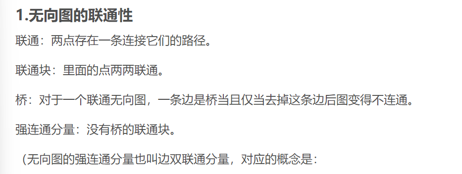

# == 数据结构与算法笔记整理 ==

### 〇、还没复习的内容

出入边表


平均查找长度ASL(gw第13章)、字符串：暴力匹配算法&KMP(gw第8章)、联通和强连通

###### KMP算法

是暴力算法的剪枝，利用模式串*（小的那个）*子串的重复性质，跳过重复比较。需要计算一个next数组，标记的是下一次模式串从什么地方开始比较。

```python
def get_next(t):    #t为模式串
    i, j = 0, -1
    next_val = [-1] * len(t)
    while i < len(t) - 1:
        if j == -1 or t[i] == t[j]:
            i += 1
            j += 1
            next_val[i] = j    # **考这个** 简单一点的。但是可能会造成主函数中的一些重复比较
            #if i < len(t) and t[i] != t[j]:
            #    next_val[i] = j
            #else:   #此即：(0-j和j-i)重复就直接跳到最前面
            #    next_val[i] = next_val[j]
        else:
            j = next_val[j]
    
    return next_val

def kmp(s, t):  #s为主串
    i, j = 0, 0
    next = get_next(t)
    while i < len(s) and j < len(t):
        if j == -1 or s[i] == t[j]:
            i += 1
            j += 1
        else:
            j = next[j]
    if j == len(t):
        return i - j
    else:
        return -1
```

###### 平均查找长度ASL

查找的意思是：在一个给定的表中找到给的元素。成功就是找到，遍历完了都没找到就是失败。

顺序查找：从头扫到尾，因此待查字符在第i个位置的话，就要比较i+1次，`ASL_suc = (n+1)/2`，扫描整个表都没找到`ASL_fail = n`

折半查找：不断从表的中央开始比，然后从中央分成左右两个子表继续比（要求：表为有序表）。比较次数就是比较的深度（准确来说是深度加1）
*如图*


哈希表查找：查的方式是线性探测法中的加1，找不到的意思是全部一直找最后找到了空元素。


###### 图的连通性




### 一、排序算法＆时间复杂度

**1. 排序算法总结**


*注：表中快排的空间复杂度有误，应为logn*

​	① 冒泡排序：一轮一轮从左往右比较相邻元素（从0号开始，和右边比），那么每一轮都会找到一个最小/最大的从最右边冒出来。O(n^2)

​	*PS：改进的冒泡排序——引入一个flag标记，标记每一趟中是否发生过交换。如果没有发生交换，说明数组有序，那么之后的趟数就不再执行！
​	flag默认为0，如果交换就flag = 1；最后如果flag为0就不再继续！*

​	② 插入排序：从左向右一个个将数圈起来，将最右侧的数插到左侧的合适位置（其中是按照冒泡的相邻比较）。因此循环套循环，O(n^2)

​	③ 希尔排序：插入排序的优化。按照某个步长进行插入排序，每一趟减小步长。

```python
#shell_sort
def shellsort(arr, n):
    gap = n // 2
    
    while gap > 0:
        j = gap
        while j < n:
            i = j - gap
            
            while i >= 0:
                if arr[i+gap] > arr[i]:
                    break
                else:
                    arr[i+gap], arr[i] = arr[i], arr[i+gap]
                i -= gap
            j += 1
        gap = gap // 2
```

​	④ 选择排序：一趟趟遍历（每一趟的编号为i），找到最小和第i个交换，O(n^2)

​	⑤ 堆排序：建堆 + 反复heappop。PercDown至多下移树的高度次即Logn，又要调整n个数，为O(nlogn)。
​	PS：大根堆可以把所有数变成负数再放进小根堆。
​	PS2：找前几个最小/最大元素，堆是nlog(k)


​	⑥ 快速排序：冒泡排序的优化。选择pivot，一趟排序让数组分为大小两部分，再对两部分递归。O(nlogn)

```python
#quick_sort(pivot取左)
def quicksort(arr, left, right):
    if left < right:
        key = partition(arr, left, right)
        quicksort(arr, left, key-1)
        quicksort(arr, key+1, right)
        
def partition(arr, left, right):
    i, j, pivot = left, right, arr[left]
    while i <= j:
        while i <= right and arr[i] <= pivot:
            i += 1
        while j >= left and arr[j] > pivot:	******
            j -= 1
        if i < j:
            arr[i], arr[j] = arr[j], arr[i]
    if arr[j] < pivot:
        arr[j], arr[left] = arr[left], arr[j]
    return j
#arr = [2,1,8,6,5,7,3,4]
#quicksort(arr,0,len(arr)-1)

#pivot取右就在 ******号 处arr[j] >= pivot; 取中间就两个都取等
```

​	⑦ 归并排序：分治算法。将左右分别排序得到有序子列，再有序归并得到整个有序子列。递归进行，O(nlogn)。值得注意的是，归并排序也是求逆序数/交换次数的算法（下面的ans）

```python
#merge_sort
def mergeSort(ls):
    if len(ls) <= 1:
        return ls, 0
    mid = int(len(ls)/2)
    left, ans_left = mergeSort(ls[0:mid])
    right, ans_right = mergeSort(ls[mid:])
    mergedlist, ans_merge = merge(left, right)
    return mergedlist, ans_left + ans_right + ans_merge

def merge(left: list, right: list):
    ans = 0
    r, l = 0, 0
    result = []
    while l < len(left) and r < len(right):
        if left[l] <= right[r]:
            result.append(left[l])
            l += 1
        else:
            result.append(right[r])
            r += 1
            ans += len(left) + r - len(result)
    result += left[l:]
    result += right[r:]	#如果r >= len(right)会返回空，不会报错
    return result, ans
```


### 二、基本数据结构——栈、队列、链表

1. 笔试知识：

##### 逻辑结构和存储结构（也叫物理结构）

*网址见最后*

逻辑结构描述的是数据节点之间的关系，存储结构描述的是数据如何存储（分配内存空间）

###### 逻辑结构：

​	集合结构【元素之间除了同属一个集合之外没有其他关系】


​	线性结构【元素之间存在一对一的相互关系】

​	

​	树状结构【元素之间存在一对多的相互关系】


​	网络结构【多对多的相互关系】


###### 存储结构：

分为顺序存储结构、非顺序存储结构，前者就是自己，后者包括链式存储结构、索引结构、散列结构。

​	顺序存储结构【内存空间连续】


​	链式存储结构【内存空间不连续（应该是可连续可不连续）】


​	索引存储结构【存在索引来检索数据】

​	

​	散列存储结构【用哈希把key映射为数组索引，再用索引得到存储地址】


###### 线性表

**零个或多个数据元素的有限序列。**

线性表的数据集合为{a1,a2,…,an}，假设每个元素的类型均为`DataType`。其中，除第一个元素a1外，每一个元素有且只有一个直接前驱元素，除了最后一个元素an外，每一个元素有且只有一个直接后继元素。数据元素之间的关系是一对一的关系。

线性表有

​	**顺序存储结构**——顺序表：地址连续
​	**链式存储结构**——链表：地址可连续可不连续	

##### 循环队列/环形队列

环形队列是开一个固定大小的空间，然后如果后面空间被完全占用就往前面放的队列；而一般队列出队之后前面的空间无法重复利用——空间仍然占用，只是头指针向后移动。

*两张图*


注意三个公式，尤其是(rear+maxSize-front) % maxSize == 在队列里面的数据个数

##### 散列表

散列表，其映射方法也即 `hash`（哈希），是利用函数映射将 `key` 映射到数组索引、再用索引得到地址 `addr` 的方法——也就是散列存储结构。其要点在于：(1) 如何构造散列函数；(2) 如何处理冲突

构造散列函数(似乎不太重要)：数字分析法；平方取中法；折叠法；除留余数法。**除留余数法是最常用的**。

处理冲突：

1. **开放地址法**：冲突之后利用合适方法计算不断得到新的地址（准确来说这里地址指的是索引），直到不冲突。`new_h = (h(key) + d_i) % m`
   	线性探测法：d_i取1,2,3,...
   	二次探测法：d_i = `±1**2`，`±2**2`，...
   	伪随机探测法：d_i 从伪随机数序列中取

   ​	**双散列法**：**`h1(key)` 得到 `hash_value`，如果这个位置为空就插入；否则，用 `h2(key)` 得到 `step` ，不断跳过 `step` 个位置直到遇到空位——注意 `h2` 是对 `key` 执行而不是对 `h1` 得到的 `hash_value` 执行。**

2. **链地址法**：把地址冲突的元素记录在一个单链表中，散列表相当于一个（散列）桶。

##### 链表

分为单（向）链表、双向链表、循环链表。

###### 循环链表

```python
class Node:
    def __init__(self, data, next = None):
        self.data = data
        self.next = next

class LinkedList:
    def __init__(self):
        self.tail = None
        self.size = 0

    def isEmpty(self):
        return self.size == 0
    
    def pushFront(self, data):  #加节点到头
        node = Node(data)
        if self.tail == None:
            self.tail = node
            node.next = self.tail
        else:
            node.next = self.tail.next
            self.tail.next = node
        self.size += 1

    def pushBack(self, data):   #加节点到尾部
        self.pushFront(data)
        self.tail = self.tail.next
    
    def popFront(self):
        if self.size == 0:
            return None
        else:
            node = self.tail.next
            self.size -= 1
            if self.size == 0:
                self.tail = None
            else:
                self.tail.next = node.next
        return node.data
```


主要要注意几个补充代码：插入、删除、颠倒

###### 颠倒链表

```python
class Node:
    def __init__(self, data, next = None):
        self.data = data
        self.next = next

class LinkedList:
    def __init__(self, ls):
        self.head = Node(ls[0])
        cur = self.head
        for i in ls[1:]:
            node = Node(i)
            cur.next = node
            cur = cur.next
    
    def reverse(self):
        prev = None
        cur = self.head
        while cur:
            next = cur.next
            cur.next = prev
            
            prev = cur
            cur = next
        self.head = prev
    
    def print(self):
        p = self.head
        while p:
            print(p.data, end=" ")
            p = p.next
        print()
```

*需要利用*`prev`*前一个节点，*`prev`*初始化为*`None`*，因为链表尾部没有后继，最后循环外将头设置为*`prev`*。*

###### 删除元素和添加元素

这里给一个循环链表删除元素的样板；

单链表删除元素简单一些，找到这个`node(PS:应该用cur.next.data == data来找)`之后直接`cur.next = cur.next.next`(注意边界判断)

单链表加元素：找到位置用`tmp`存储`next`，之后就ez了

```python
    def remove(self, data):
        if self.size == 0:
            return None
        else:
            cur = self.tail
            while cur.next.data != data:
                cur = cur.next
                if cur == self.tail:
                    return False
            self.size -= 1
            if cur.next == self.tail:
                self.tail = cur
            cur.next = cur.next.next
            return True
```


2. 编程题目：

​	①栈： 括号匹配——左括号进栈，遇到右括号弹栈，但是stack[-1]不匹配就错误。
​		数位转换——将x位数不断除以y，并将余数压入栈；最后依次出栈就是八进制数的各个位上的数字（从高位到低位）。

​	②前中后序表达式：
**(1)计算**：后序计算只需要一个stack，从左往右遍历，遇到数字入栈、运算符弹两次栈计算，结果入栈，rt.

```python
#s = '7 8 + 3 2 + /'
stack = []
for token in s:
    if token in "+-*/":
        num2, num1 = stack.pop(), stack.pop()	#num2后进先出，要注意num2就是运算符后面的那一个
        stack.append(doMath(token, num1, num2))	#doMath是计算 num1 token num2
    else:
        stack.append(int(token))
print(stack[-1])
```

前序计算也只要一个stack，从右往左遍历，遇到数字入栈，遇到操作符弹栈两次，结果入栈——注意先出的是num1而不是num2了

```python
#s = '+ + 2 * 3 5 6'
stack = []
for i in range(len(s)-1, -1, -1):
    token = s[i]
    if token in '+-*/':
        num1, num2 = stack.pop(), stack.pop()
        stack.append(doMath(token, num1, num2))
    else:
        stack.append(int(token))
print(stack[-1])
```


**(2)前中后序转化**

**Shunting Yard(调度场)算法**——中序转后序：+、-：1、*、/：2，或者将括号标注（：0，）：2。之后用一个栈过渡、一个栈（列表）接收。从左到右遍历：

操作数：加到输出栈。
左括号进运算符栈。
运算符：——如果优先级高于运算符栈栈顶的，则将运算符推入运算符栈；
	否则将栈顶运算符弹出、并添加到输出栈，直到优先级条件允许，再将该运算符入栈。
右括号：弹出栈顶运算符&添加到输出栈，直到遇到左括号（左括号不入栈）
剩余部分：把stack全部加到postfix里面。
Trick: number buffer——用number ->str 存储num和点，直到遇到运算符将number转化为float，针对有小数点的情况(如下，注意可能遍历完number != ''，要先加到postfix再处理stack里面的字符)

```python
#
prec = {'+': 1, '-': 1, '*': 2, '/': 2}
def infix_to_postfix(s: str):
    stack, postfix = [], []
    number = ''	#number buffer
    
    for char in s:
        if char.isnumeric() or char == '.':
            number += char
        else:
            if number:
                num = float(number)
    			if num.is_integer():
                    postfix.append(int(num))
            	else:
                    postfix.append(num)
            if char in '+-*/':	#上面的if和下面的判断不是一起的
                while stack and stack[-1] in '+-*/' and prec[char] <= prec[stack[-1]]:
                    postfix.append(stack.pop())
                stack.append(char)
            elif char == '(':
                stack.append(char)
            elif char == ')':
                while stack and stack[-1] != '(':
                    postfix.append(stack.pop())
                stack.pop()
#处理剩余部分	
    if number:	
        num = float(number)
        if num.is_integer():
            postfix.append(int(num))
        else:
            postfix.append(num)
	
    while stack:
        postfix.append(stack.pop())
           
	return ' '.join(str(x) for x in postfix)
```


​	②队列：from collections import deque是双端队列，此外还有循环队列——例：约瑟夫问题http://cs101.openjudge.cn/2024sp_routine/03253/

给n,p,m，其中n为数目(编号1-n)，m为步长，p为起始编号

```python
#
n, p, m = map(int, input().split())
queue = [i for i in range(n)]
sol = []
k = p - 2	#编号从1开始故减1，此外p小孩自己要报数所以再减1
while len(queue) > 0:
    k += m
    k = k % len(queue)
    ans.append(str(1 + queue.pop(k)))
    k -= 1	#k小孩自己又要报数所以减1
print(','.join(sol))
```

在bfs中有很丰富的利用。


### 三、树

##### 树的类实现：

```python
#二叉树
class TreeNode:
    def __init__(self, val):
        self.val = val
        self.left = None
        self.right = None
#多叉树
self.children = []
```

此外还可以用邻接表的方式建立树——{node: []}

##### 笔试题目

1. 一棵含有101个结点的二叉树中有36个叶子结点，度为 2 的结点个数是 _ _ _ _ 和度为１的结点个数是 _ _ _ _ 。**（35，30）**

​	每多一个度为2的节点，叶子节点个数就会加1——本来只有根节点的树叶子节点个数是1，现在多一个度为2的节点（要么根节点多两个儿子要么多一个度为2的儿子），可以观察到叶子节点个数变为2，即加1，递归就有公式 `leaves = 1 + d_2`

#### 一些重要的类别

##### 堆

堆利用的是完全二叉树的性质——可以用数组表示，即如果将根节点放在1处（0为第一个位置），层次遍历将节点放入数组，那么一个节点有如下关系：
	`parent_index = node_index // 2`
	`l_child_index = node_index * 2`
	`r_child_index = 1 + node_index * 2`

这样就很方便可以用列表处理这样一个树。

堆的定义：分大顶堆和小顶堆，同样是递归定义。以小顶堆为例——根节点是所有节点中最小的。

###### 手搓堆的一些tips：

堆无外乎两个操作：加和删。

`percUp`
加的时候一般加在list末尾，然后向上调整 `percUp` 。`percUp`意思是不断向上和parent比较（并交换）。接收参数`i`也就是待调整数的index，不断和parent 即`i//2`比较大小和交换直到`i//2 == 0`.

`percDown`
删的时候就是删最小值，但是用谁代替？最方便的就是用列表末尾代替（就不会改变前面的顺序），再向下调整`percDown`。`percDown`意思是不断向下和最小的child比较（并交换）。同样接收参数`i`即index，不断和`minchild`比较直到没有child即`i*2 > currentSize`

*上代码*

```python
class BinHeap:
    def __init__(self):
        self.HeapList = [0]
        self.currentSize = 0
    
    def percUp(self,i):
        while i // 2 > 0:
            if self.HeapList[i] < self.HeapList[i//2]:
                temp = self.HeapList[i//2]
                self.HeapList[i//2] = self.HeapList[i]
                self.HeapList[i] = temp
            i = i // 2

    def insert(self,k):
        self.HeapList.append(k)
        self.currentSize += 1
        self.percUp(self.currentSize)
    
    def minChild(self, i):      #只用在percDwon里面，而percDown中判断i*2<size意思是取
        if i*2 + 1 > self.currentSize:      #非叶子节点，因此一定有儿子，但是可能没右儿子
            return i*2
        else:
            if self.HeapList[i*2] < self.HeapList[i*2 + 1]:
                return i*2
            else:
                return i*2 + 1
    
    def percDown(self, i):
        while i*2 <= self.currentSize:
            mc = self.minChild(i)
            if self.HeapList[i] > self.HeapList[mc]:
                temp = self.HeapList[mc]
                self.HeapList[mc] = self.HeapList[i]
                self.HeapList[i] = temp
            i = mc
    
    def delMin(self):
        retval = self.HeapList[1]
        self.HeapList[1] = self.HeapList[self.currentSize]
        self.HeapList.pop()
        self.currentSize -= 1
        self.percDown(1)
        return retval
    
    def buildHeap(self, ls):
        i = len(ls) // 2
        self.currentSize = len(ls)
        self.HeapList = [0] + ls
        while i > 0:
            self.percDown(i)
            i = i - 1
```


###### 堆排序的手搓tips：

笔试中似乎手搓堆排序的填空更多，也就不让自己写class类了。需要实现的函数就是`percDown(& minchild)`和`heapify/buildHeap`。

这里补充一下`heapify`(上面没有讲到)：意思是把给定的数组调成堆，因此用到的是`percDown`

*（也可以使用*`percUp`*，但是由于排序需要*`delMin`*，而*`delMin`*必然用到*`percDown`*，因此选择前者）*

然后考虑从哪里开始向下调整、是从上方继续perc还是下方：
	选择从下往上依次`percDown`，这样不会出现反复调整；选择从最后一个非叶子节点开始调整，因为叶子节点不用调整。
	**也就是说：从 `len(arr)//2 - 1` 开始倒序遍历**

然后考虑怎样得到最后的序列：如果用ans列表存储自然是ez的，但是笔试就是要搞人。要考虑到堆只能用来找最小值。

以大顶堆从小到大排序为例：
	从`i = len(arr) - 1`向左遍历，交换`arr[i]` 和`arr[0]`也就是把最大数放在左边，然后将`heapSize -= 1`，继续遍历。
	*不论大/小顶堆以及升/降排序，都只能把第一个数往末尾放；类似于手搓堆中*`delMin`*，只有把最后的数放到前面才不会打乱顺序（实际上是因为*`percDown`*的操作中索引的关系不能改变*

*上代码*

```python
#输入样例:	1 3 43 8 7
#输出样例:	1 3 7 8 43

#请进行程序填空：
def heapSort(a):
    heapSize = len(a)

    def goDown(i):
        if i * 2 + 1 >= heapSize:  # a[i]没有儿子
            return
        L, R = i * 2 + 1, i * 2 + 2
        if R >= heapSize or a[L] > a[R]:  # 1分
            s = L
        else:
            s = R
        if a[s] > a[i]:
            a[i], a[s] = a[s], a[i]  # 2分
            goDown(s)

    def heapify():  # 将列表a变成一个堆
        for k in range(len(a) // 2 - 1, -1, -1):  # 1分  第一个数在[len(a)//2 – 1,len(a)-1]均可
            goDown(k)

    heapify()
    for i in range(len(a) - 1, -1, -1):
        a[i], a[0] = a[0], a[i]  # 1分
        heapSize -= 1
        goDown(0)  # 1分

a = list(map(int, input().split()))
heapSort(a)
for x in a:
    print(x, end=" ")
```


##### 二叉搜索树/二叉排序树（BST）

建树：左<root<右，由于建树时加入顺序不同会得到不同的树

删除节点：用左子树的最大元素/右子树的最小元素代替即可（二选一，都ok）。


##### 各种算法：

###### ① huffman编码：

从下往上建立树，权值越高的节点越靠近树的根部。因此利用heapq一直合并权值最小的两个节点。

###### ②bfs、dfs算法：

分别利用queue和递归实现。


### 四、图

#### 图的实现：

```python
#类实现
import sys
class Vertex:
    def __init__(self, key):
        self.key = key
        self.con = {}
        self.color = 'white'	#用于标记是否遍历，还有gray,black
        self.distance = sys.maxsize	#用于dijkstra,prim,下同
        self.pred = None	

    def __lt__(self, other):
        return self.key < other.key
    
    def add_nbr(self, nbr, weight = 0): #nbr: Vertex
        self.con[nbr] = weight

    def get_nbr(self, nbr):
        return self.con.get(nbr)
    
    def get_con(self):
        return self.con.keys()
    
class Graph:
    def __init__(self):
        self.vt = {}
        self.vtnum = 0

    def add_vt(self, key):
        new_Vertex = Vertex(key)
        self.vtnum += 1
        self.vt[key] = new_Vertex
        return new_Vertex
    
    def get_vt(self, key):
        return self.vt.get(key)
    
    def add_edge(self, f, t, cost=0):
        if f not in self.vt:
            new_Vertex = self.add_vt(f)
        if t not in self.vt:
            new_Vertex = self.add_vt(t)
        self.vt[f].add_nbr(self.vt[t], cost)
        self.vt[t].add_nbr(self.vt[f], cost)    #无向图补这句
```

此外还可以用矩阵图、邻接表图。棋盘类用矩阵图比较好。


#### 图算法：

##### 拓扑排序与环的检测

拓扑排序针对有向、无环图，利用的是A是B的条件的这种性质进行排序。无环则拓扑排序存在，二者是等价的。

###### 拓扑排序的方法

拓扑排序的方法主要是对入度为0的节点node访问其nbr，将nbr入度减一之后删去node。删除过程中，如果剩下的所有节点入度都大于0，说明有环；如果节点删完了说明无环。
`由此引入Kahn算法`

###### Kahn算法

上述方法可以看出是BFS方法，直接上代码。

```python
from collections import deque, defaultdict

def topological_sort(graph):
    indegree = defaultdict(int)
    result = []
    queue = deque()
    
# 计算每个顶点的入度
for u in graph:
    for v in graph[u]:
        indegree[v] += 1

# 将入度为 0 的顶点加入队列
for u in graph:
    if indegree[u] == 0:
        queue.append(u)

# 执行拓扑排序
while queue:
    u = queue.popleft()
    result.append(u)

    for v in graph[u]:
        indegree[v] -= 1
        if indegree[v] == 0:
            queue.append(v)

# 检查是否存在环
if len(result) == len(graph):
    return result
else:
    return None
```

###### 无向图检测环

先理解无向图找环：无向图没有方向要求，dfs就是一路往下走，那么如果走回到visited节点就说明有环
	但是无向图会有nbr的neighbor回到node的情况，所以要多parent参数。同时起始节点应该视为没有parent，那么就给一个参数 -1。
	两个判断条件的理解：
		①if not visited and dfs: 就是从nbr重新开始深搜，parent = node
		②elif parent != nbr（即nbr已经visited）: 说明从nbr开始的深搜路过node回到nbr；同时parent != nbr排除自己回到自己的情况

PS：不输入parent参数会有两种别的方法——其一是不要elif，但是会导致dfs回到nbr的情况被排除（实际上dfs不会得到True的结果）；其二是用0,1,2类似有向图的方法，但是会导致回到parent又回来（二者状态都是1，直接return True）

​	*上代码*

```python
#无向图找环
#方法一：并查集（特别好理解）——
	#读取边的两个端点先判断如果find(x)=find(y),那么有环；如果无环就union(x,y)
#方法二：dfs（和有向图类似，但是有不同）

#graph为 列表套列表式 邻接表
visited = [False]*n
def dfs(node: int, parent: int):
    visited[node] = True
    for nbr in graph[node]:		#nbr=>int
        if not visited[nbr]:
            if dfs(nbr, node):
                return True
        elif parent != nbr:
            return True
    return False
for node in range(n):
    if not visited[node]:
        if dfs(node, -1):
            print('Yes')
            break
else:
    print('No')
```

###### 有向图检测环

其实正常用拓扑排序（先决条件——边的头是尾的先决条件，如果自己是自己的先决条件就无法排序，此时正好图是有环的）的方法：不断移除入度为0的节点，全部移除就无环、未完全移除但是此时找不到这样的节点就有环。

另外的方法：将节点分为未访问、正在访问、访问结束三个状态（用visited 字典 存储0,1,2）表示；
	两个判断条件的理解：
		①if visited[v] == 0 and dfs(v)：就是从v重新开始深搜。
		②elif visited[v] == 1：说明u是 从v开始的深搜 经历的点，而且此时回到了v。

​	*上代码*

```Python
def dfs(u):
    st[u] = 1 # 访问中

    for v in adj[u]:
        if st[v] == 0: # 未访问
	        # prev[v] = u  # 无向图要记录父节点
	        if dfs(v):
		        return True
        elif st[v] == 1: # 子节点v在访问中, 说明搜索树中可以从v到v, 有环
	        # if prev[u] != v:  # 无向图中要排除的情况
			return True

    st[u] = 2 # 访问完
	return False
```

###### Kosaraju算法：双DFS


##### 最短路径与 $\text{Dijkstra}$​ 算法

***树上的Dijkstra，visited是记录dist的字典，判断跳过条件in visited还要加一条new_dist > visited[cur]***

Dijkstra找最短路径的方法主要是利用heapq实现的优先队列。一般情况下pq里面存储` (dist, state, (pos))`，其中state有时会有，是某种限制条件（比如最多走的步数等等用来记录步数）。基本步骤如下：

​	①设置dist数组，全部记录为sys.maxsize，其作用为剪枝。
​	②初始节点入队
​	③while循环：node出队，判断是否要扩展/判断是否为终点*（区别会在后面介绍）*；再扩展到nbr。注意nbr修改dist的条件是new_dist < dist[nbr]。	
​	*上代码*

```python
#Graph类的dijkstra
import heapq，sys
class Vertex:
    def __init__(self, key):
		self.dist = sys.maxsize
        self.pred = None

def dijkstra(start):
    pq = []
    start.dist = 0
    heapq.heappush(pq, (0, start))
    visited = set()
    
   	while pq:
        cur_dist, cur = heapq.heappop(pq)
        if cur in visited:
            continue
        visited.add(cur)
        
        for nbr in cur.con:
            new_dist = cur_dist + cur.get(nbr)
            if nbr not in visited and new_dist < nbr.dist:	#not in visited也可以不用，反正有new_dist的判断条件	#似乎不能不用？？？
                nbr.dist = new_dist
                nbr.pred = cur
                heapq.heappush(pq, (new_dist, nbr))
                
#邻接表或矩阵的dijkstra. graph: {a: {b: weight}}
import heapq,sys
dist = [sys.maxsize] * n
visited = set()
def dijkstra(start: int):
    pq = []
    dist[start] = 0
    heapq.heappush(pq, (0, start))
    
    while pq:
        cur_dist, cur = heapq.heappop(pq)
        if cur in visited:
            continue
        visited.add(cur)
        
        for nbr in graph[cur]:
            new_dist = cur_dist + graph[cur][nbr]
            if new_dist < dist[nbr] and nbr not in visited:
                dist[nbr] = new_dist
                heapq.heappush(pq, (new_dist, nbr))
                #可以用list记录前驱顺序
#多源最短路——记得重置dist和visited噢~
```


###### visited标记问题

一般情况下，dijkstra是出队标记。但是有的时候可以不标记：
	给定终点，cur==end的时候return。

###### 剪枝的有关问题

当遇到有state的限制条件的时候，并不能像一般的dijkstra一样一定能找到**答案的**最短路(对一般的dijkstra，答案的最短路实际上就是真正的最短路)，因为限制条件可能会让实际上会走入死胡同的真正最短路进入并且标记在dist里面，就妨碍了答案的最短路中的路径入队。

`一点说明：来自题目K站中转`
https://leetcode.cn/problems/cheapest-flights-within-k-stops/solutions/874532/dijkstraji-bai-100yong-hu-jie-jue-guan-f-hpmn

因此我们需要在new_dist < dist[nbr]外加入新的剪枝——用数组记录到当前站点的最小中转次数，如果new_dist≥dist[nbr]，就让k<visited[nbr]的也入队——因为如果最短路走到死胡同，那么答案最短路的部分路径(指到达当前nbr节点的路径)一定中转次数要比最短路少！


##### 最小生成树与 $Prim$​ 算法

与最短路径不同，$Prim$算法构建最小生成树——遍历所有的节点使得权值和最小。但是相同的是二者也都是用优先队列实现的。

​	*上代码*
```python
#和dijkstra的差异就在存储路径上面
import heapq, sys
def prim(start):
    pq, start.dist, visited = [], 0, set()
    heapq.heappush(pq, (0, start))
    
    while pq:
        cur_dist, cur = heapq.heappop(pq)
        if cur in visited:
            continue
        visited.add(cur)
        
        for nbr in cur.con:
            weight = cur.get_nbr(nbr)
            if nbr not in visited and weight < nbr.dist:
                nbr.dist = weight
                nbr.pred = cur
                heapq.heappush(pq, (weight, nbr))
#计算最小生成树总权值
sol = 0
cur = end	#cur指向end
while cur.pred:
    sol += cur.dist
    cur = cur.pred
sol += cur.dist
```

*上面的计算总权值方法需要 Vertex 的 pred属性，但是如果用矩阵图或者邻接表怎么办呢？*
	可以在出队的时候sol += dist，同时加上全部遍历一遍的判断。

```python
#注意全部遍历的判断应该放在出栈标记(和sol+=)之后，否则若所有元素只入队一次，那么最后不会返回sol(而且sol的值少一部分)
sol = 0
while pq:
    cur_dist, cur = heapq.heappop(pq)
    if cur in visited:
        continue
    visited.add(cur)
    sol += dist[cur]
    
    if len(visited) == n:
        return sol
```


##### 最小生成树与 $Kruskal$ 算法

$Kruskal$ 算法利用的是并查集。其基本步骤为：

​	①将图中所有边按权重从大到小排序
​	②初始化新的优先队列存储边 `[(f, t, weight)]`，用于存储最小生成树的边
​	③重复以下步骤，直到边集中的边数等于顶点数减一或者所有边都已经考虑完毕：

- 选择排序后的边集中权重最小的边。
- 如果选择的边不会导致形成环路（即加入该边后，两个顶点不在同一个连通分量中），则将该边的两端点合并，并且把边加入最小生成树的边集中。

​	*上代码*

```python
#
p = [x for x in range(n)]

def find(x):
    if p[x] != x:
        p[x] = find(p[x])
    return p[x]

def union(a, b):
    p[find(a)] = find(b)

#edges = [(weight, a, b)]
def kruskal(edges: list[tuple[int]])
	edges.sort()
    totalweight = 0
    for w, a, b in edges:
        if find(a) != find(b):
            union(a, b)
            totalweight += w
            # 此处可统计添加的边数, 如果添加的总边数小于 n - 1 就说明图不连通
    return totalweight
```

*罗佬的总结太好了，让我的理解得到了完完全全的升华，下面照搬了不少请罗佬见谅*

##### DFS：递归写法

```python
def dfs(node):
    """
    前序遍历以node为根的搜索树, 但不访问已访问过的节点;
    没有 base case, 靠搜完来终止.
    """
    # step1: 访问根
    # 访问
    visited.add(node)
    
	# step2: 遍历子树
	for nb in node.nbs:
		if nb not in visited:
			dfs(nb)
			

visited = set()
dfs(startNode)
```

##### DFS、BFS、其他算法的非递归写法

```python
def search(startNode):
	container = Container([startNode])
	# stack -> dfs, queue -> bfs, heap -> ucs.
    expanded = set()
    
    while container:
        node = container.pop()
        # 在这里访问节点可以重复访问
        if node not in expanded: # 1. 找到下一个要扩展的节点
	        # 在这里访问节点就只访问一次
	        # 2. 扩展
	        for nb in node.nbs: 
		        # if nb not in expanded:
	            container.push(nb)

			# 3. 扩展完做标记
			expanded.add(node) 
```

注意一个问题：**BFS标注visited的时机**

------

###### BFS 常见写法

```python
def bfs():
	queue = deque([startNode])
    visited = {startNode} # 改个名比较好, 因为其含义是是否已入过队
    
    while queue:
        node = queue.popleft()
        
        for nb in node.nbs:
            if nb not in visited:
                queue.append(nb)
                visited.add(nb)
```

如上所述, 这个写法对 BFS 来说是正确的, 但仅将队列换成栈后不是 DFS, 也不能套用到 UCS.

###### 错误写法

```Python
def wrongSearch(startNode):
	container = Container([startNode])
    visited = set()
    
    while container:
        node = container.pop()
		visited.add(node)
		
		for nb in node.nbs:
			if nb not in expanded:
				container.push(nb)
```

这个写法的问题是, 一个节点进入容器但还没弹出 (及标记) 时, 它可以重复入队, 然后这些重复的节点每次弹出后都会做扩展, 出现重复扩展的问题.

------

要记住先把根节点标记visited，之后访问nbr的时候当场标记visited，而不是在弹出的时候标记。

###### 狭义CSPs问题

这里的狭义CSPs指那些终止条件为完全遍历一遍的图问题，例如走遍棋盘每一个节点。运用的方法是DFS，但是实质上也是一种回溯——

​	在子树遍历结束之后要***回溯***到根节点。因此需要考虑回溯时是否要把改变的变量恢复到原来状态的问题。例如探索有多少路径能走完棋盘每一个点时，就要先标记新节点visited，再dfs新节点，dfs结束之后标记non-visited。

###### 

### 五、之前的编程题目

​	单调栈：用于找左/右第一个大/小数。有单调增/减栈。

```python
#单调递增栈（从栈顶向栈底递增）
nums = input()	#输入数组
stack = []
for i in range(len(nums)):	#例：正向遍历
    num = nums[i]
    while stack and stack[-1] < num:	#或者<=
        stack.pop()
    stack.append(num)
#其中可以在pop、多加一个index栈做文章

#单调递减栈只需要改成>或>=,此外还可以逆向遍历
```

1. 递增栈：

​	①找右侧第一个更大：正向遍历，当前即将插入的元素 是 pop的元素 的更大
​	②找左侧第一个更大：正向遍历，当前栈顶的元素（pop循环完之后） 是 当前即将插入的元素 的更大
​	PS：如果①没有pop或②插入时栈为空，说明没有更大元素。

2. 递减栈：

   ①找左侧第一个更小：正向遍历，当前栈顶元素 是 即将插入的元素的更大
   ②找右侧第一个更小：正向遍历，当前即将插入的元素 是 pop的元素 的更大
   PS同上。

简记为：都可以正向遍历，找更大/更小用递增/递减栈，找左侧就看插入时栈顶、找右侧就看pop时即将插入的元素。
PS：找更大/更小(>,<)那么写成>=和<=，如果是≥/≤就写成<和>

变形题：接雨水
给定 `n` 个非负整数表示每个宽度为 `1` 的柱子的高度图，计算按此排列的柱子，下雨之后能接多少雨水。
输入：height: list[int]，输出：int

思路：用递增栈，相当于找碗的左半边，当需要pop时说明找到右半边。注意计算雨水的时候可以**分层计算**

```python
#
height = list(map(int, input().split()))
stack, index = [], []	#相当于分别存x, y坐标

sol = 0
for i in range(len(height)):
    h = height[i]
    while stack and stack[-1] < h:	#≤和<都ok,可以从下面的+=中推导出来结果是一样的
        h0, i0 = stack.pop(), index.pop()
        if stack:
            sol += (min(stack[-1], h) - h0) * (i - i0 - 1)
    stack.append(h)
    index.append(i)
print(sol)
```

利用栈的后进先出，可以实现很多***括号分割、字符串逆序***的问题。
例：整人的题词本http://cs101.openjudge.cn/practice/20743/

```python
#
s = input()
stack = []
for token in s:
    if token == ')':
        temp = []
        while stack and stack[-1] != '(':
            temp.append(stack.pop())
        stack.pop()
        stack += temp
    else:
        stack.append(token)
print(''.join(stack))
```

##### 编程题目：

​	①数据接收的方法（解析树）：

括号嵌套树：括号分割——利用栈http://cs101.openjudge.cn/practice/24729/

```python
#input() = A(B(E),C(F,G),D(H(I)))
class TreeNode:...
def prase_tree(s):
    stack = []	#栈中存储()外即上一级node
    node = None
    for char in s:
        if char.isalpha():
            node = TreeNode(char)
            if stack:
                stack[-1].children.append(node)
        elif char == '(':
            if node:
                stack.append(node)
                node = None
        elif char == ')':
            if stack:
                node = stack.pop()
    return node
```

表达式树：http://cs101.openjudge.cn/practice/25140/

```python
#
class TreeNode:
    def __init__(self, val):
        self.val = val
        self.left = None
        self.right = None

def prase_tree(s):
    stack = []
    for token in s:
        node = TreeNode(token)
        if token.islower():
            stack.append(node)
        else:
            b, a = stack.pop(), stack.pop()
            node.left, node.right = a, b
            stack.append(node)
    return stack[0]    #root
```

前+中/中+后建树：关键在用pre/post找到根节点，然后in中根节点分开左右子树，递归即可。

节点编号有序，给子节点编号：http://cs101.openjudge.cn/practice/27638/

```python
#
def prase_tree():
    n = input()
    nodes = [TreeNode(i) for i in range(n)]
    has_parent = [False] * n
    for i in range(n):
        l, r = map(int,input().split())
        if l != -1:
            nodes[i].left = nodes[l]
            has_parent[l] = True
        if r != -1:
            nodes[i].right = nodes[r]
            has_parent[r] = True
    root_index = has_parent.index(False)
    root = nodes[root_index]
    return root
```

另外，无序的话把nodes改为字典 {val: node(val)}，找root也可以用字典。

两个奇怪的题：树的转换http://cs101.openjudge.cn/dsapre/04081/
	多叉树-->左儿子右兄弟树

```python
class TreeNode:
    def __init__(self):
        self.children = []
        self.left = None
        self.right = None

root = TreeNode()
nodes = [root]
steps = list(input())
for step in steps:
    if step == 'd':
        node = TreeNode()
        nodes[-1].children.append(node)
        nodes.append(node)
    else:
        nodes.pop()
        
def prase_tree(root: TreeNode):	#可以适当记忆一下
    if root.children:
        root.left = prase_tree(root.children.pop(0))
        cur = root.left
        while root.children:
            cur.right = prase_tree(root.children.pop(0))
            cur = cur.right
    return root
```

树的镜面映射：http://cs101.openjudge.cn/practice/04082/

```python
def prase_tree(arr, index):	#左儿子右兄弟的左子树全部是儿子，递归处理完之后，index+=1，指向的是儿子的兄弟节点——也就是现在的节点的儿子。
    val, state = arr[index][0], int(arr[index][1])
    node = TreeNode(val)
    if state == 0 and val != '$':
        index += 1
        child, index = prase_tree(arr, index)
        node.children.append(child)
        index += 1
        child, index = prase_tree(arr, index)
        node.children.append(child)
    return node, index
```

​	编程题目：
食物链：http://cs101.openjudge.cn/practice/01182

```python
#开三倍数组，分别存ABC三类动物，
class DisjSet:
    def __init__(self, n):
        self.parent = [i for i in range(n+1)]
        self.rank = [0]*(n+1)

    def find(self, x):
        if self.parent[x] != x:
            self.parent[x] = self.find(self.parent[x])
        return self.parent[x]
    
    def union(self, x, y):
        xset, yset = self.find(x), self.find(y)
        self.parent[xset] = self.parent[yset]

n, k = map(int, input().split())
disjset = DisjSet(3 * n)
sol = 0
dire = [(0, n), (n, 2*n), (2*n, 0)]

for _ in range(k):
    info, x, y = map(int, input().split())
    if x > n or y > n:
        sol += 1
    elif info == 1:
        state = True
        for i,j in dire:
            if disjset.find(x+i) == disjset.find(y+j) or disjset.find(x+j) == disjset.find(y+i):
                state = False
                break
        if not state:
            sol += 1
        else:
            disjset.union(x, y)
            disjset.union(n + x, n + y)
            disjset.union(2*n + x, 2*n + y)

    elif info == 2:
        state = True
        for i,j in dire:
            if disjset.find(y+i) == disjset.find(x+j):
                state = False
                break
        if x == y:
            sol += 1
        elif not state:
            sol += 1
        elif disjset.find(x) == disjset.find(y) and disjset.find(n + x) == disjset.find(n + y) and disjset.find(2*n + x) == disjset.find(2*n + y):
            sol += 1
        else:
            for i, j in dire:
                disjset.union(x+i, y+j)
print(sol)
```

发现它抓住它：http://cs101.openjudge.cn/2024sp_routine/01703/

```python
#开两倍并查集，分别代表两个团伙
t = int(input())
for _ in range(t):
    n, m = map(int, input().split())
    disjset = DisjSet(2*n)
    for i in range(m):
        info, a, b = input().split()
        a, b = int(a), int(b)
        if info == 'D':
            disjset.union(a, n+b)
            disjset.union(b, n+a)
        else:
            a_set, a_set1, b_set, b_set1 = disjset.find(a), disjset.find(n+a), disjset.find(b), disjset.find(n+b)
            if a_set == b_set or a_set1 == b_set1:
                print('In the same gang.')
            elif a_set == b_set1 or a_set1 == b_set:
                print('In different gangs.')
            else:
                print('Not sure yet.')
```

###### Trie前缀树

```python
#
class TrieNode:
	def __init__(self):
		self.child = {}

class Trie:
	def __init__(self):
		self.root = TrieNode()

	def insert(self, arr):
		cur = self.root
        for num in arr:
            if num not in cur.child:
                cur.child[num] = TrieNode()
            cur = cur.child[num]

    def search(self, arr):
        cur = self.root
        for num in arr:
            if num not in cur.child:
                return 0
            cur = cur.child[num]
        return 1
```


###### 一些题目

```python
#三维接雨水——ucs
import heapq, sys
class Solution:
    def trapRainWater(self, heightMap: List[List[int]]) -> int:
        m, n = len(heightMap), len(heightMap[0])
        dire = [(-1, 0), (1, 0), (0,-1), (0, 1)]
        pq, visited = [], set()
        for i in range(n):
            heapq.heappush(pq, (heightMap[0][i], (0, i)))
            visited.add((0, i))
            heapq.heappush(pq, (heightMap[m-1][i], (m-1, i)))
            visited.add((m-1, i))
        for i in range(m):
            heapq.heappush(pq, (heightMap[i][0], (i, 0)))
            visited.add((i, 0))
            heapq.heappush(pq, (heightMap[i][n-1], (i, n-1)))
            visited.add((i, n-1))

        sol = 0
        while pq:
            h0, pos = heapq.heappop(pq)
            x, y = pos

            if (x, y) not in visited:
                for dx, dy in dire:
                    nx, ny = x+dx, y+dy
                    if 0<nx<m-1 and 0<ny<n-1 and (nx, ny) not in visited:
                        h = max(h0, heightMap[nx][ny])
                        sol += max(0, h - heightMap[nx][ny])
                        heapq.heappush(pq, (h, (nx, ny)))
                visited.add((x,y))
        
        return sol
```


###### ③并查集：

```python
#union1,union2几乎可以混用
class DisjSet:
    def __init__(self, n):
        self.parent = [i for i in range(n)]
        self.rank = [0] * n

    def find(self, x):
        if self.parent[x] != x:
            self.parent[x] = self.find(self.parent[x])
        return self.parent[x]
    
    def union1(self, x, y):
        xset, yset = self.find(x), self.find(y)
        if xset == yset:
            return
        if self.rank[xset] > self.rank[yset]:
            self.parent[yset] = xset
        else:
            self.parent[xset] = yset
            if self.rank[xset] == self.rank[yset]:
                self.rank[yset] += 1

    def union2(self, x, y):
        xset, yset = self.find(x), self.find(y)
        self.parent[yset] = xset
```


### 六、一些网址与参考资料

1. 逻辑结构和存储结构 https://blog.csdn.net/qq_40687864/article/details/119886670?ops_request_misc=%257B%2522request%255Fid%2522%253A%2522171850701216800222845396%2522%252C%2522scm%2522%253A%252220140713.130102334..%2522%257D&amp;request_id=171850701216800222845396&amp;biz_id=0&amp;utm_medium=distribute.pc_search_result.none-task-blog-2~all~top_positive~default-1-119886670-null-null.142^v100^pc_search_result_base1&amp;utm_term=%E9%80%BB%E8%BE%91%E7%BB%93%E6%9E%84%E5%92%8C%E5%AD%98%E5%82%A8%E7%BB%93%E6%9E%84&amp;spm=1018.2226.3001.4187


